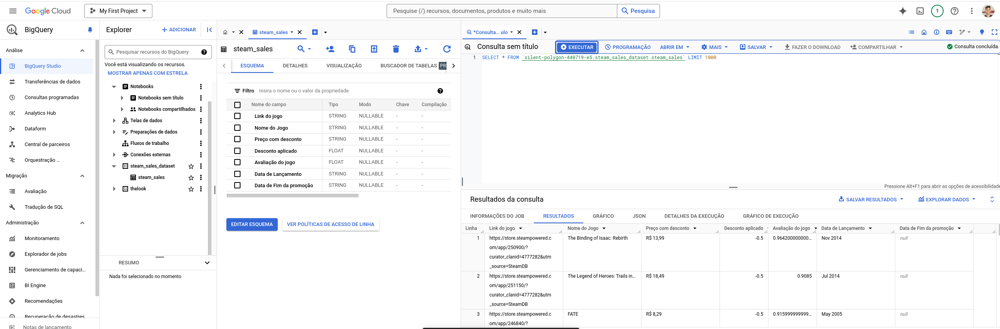
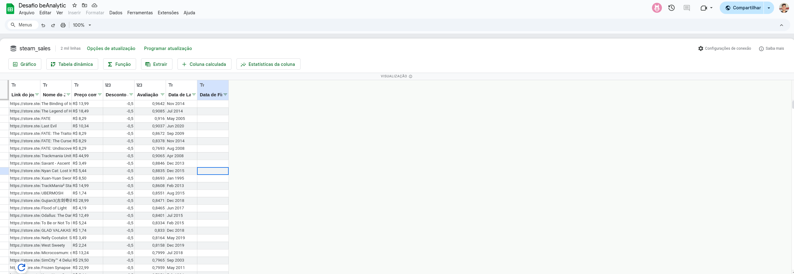
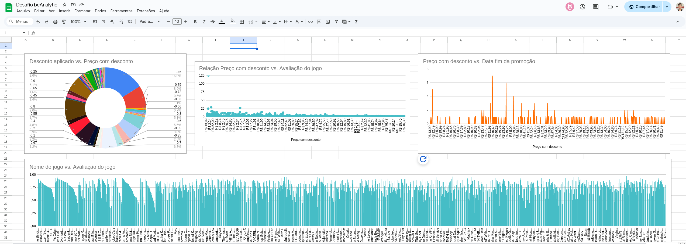

# desafio-beAnalytic

Neste repositório estão armazenados os arquivos criados para a solução para o desafio proposto pela beAnalytic.

### [Link do Google Sheets com os dados](https://docs.google.com/spreadsheets/d/1qsGO-Bdx5kANTw2fhtPQEpq9rZs4wRgQ5Hj-Fzbgm7Y/edit?usp=sharing)

### [Link do Notebook com solução realizada](https://drive.google.com/file/d/1C3V8lBzvOO8drWwtBjLU1-tCfxpgA06q/view?usp=sharing)

## Como executar o projeto

Crie um ambiente virtual Python

    python -m venv <nome_do_env>

Conecte-se ao ambiente virtual

    source <nome_do_env>/bin/activate

Realize a instalação das dependências do requirements.txt

    pip install requirements.txt

Crie um arquivo .env com a chave GOOGLE_APPLICATION_CREDENTIALS para que seja possível inserir dados na sua base do BigQuery

A automação realiza a captura dos dados utilizando Selenium e BeautifulSoup, o resultado é armazenado em um arquivo csv chamado steamdb_sales.csv

Resultado obtido no BigQuery

Resultado dos dados conectados a planilha do Google Sheets

Insights extraídos dos dados que foram capturados

